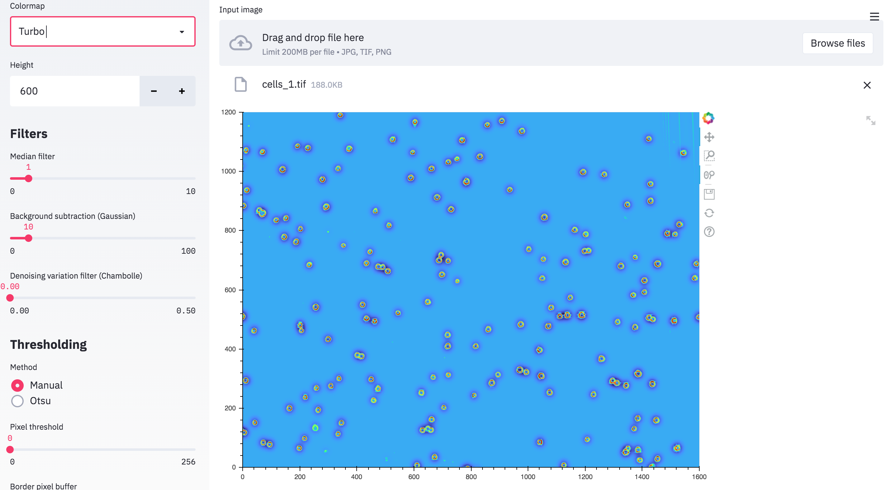
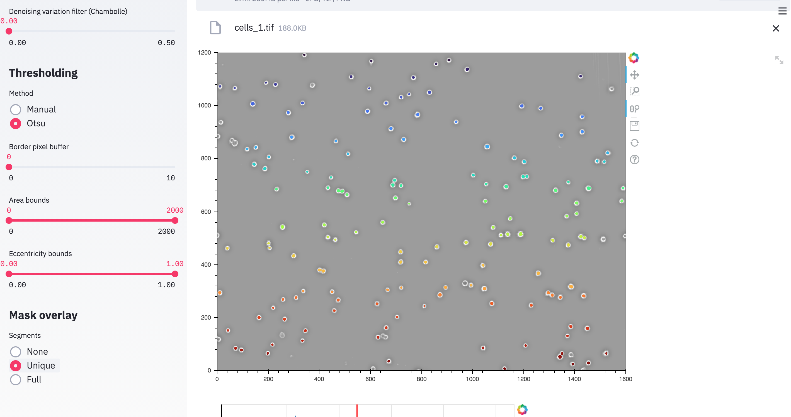
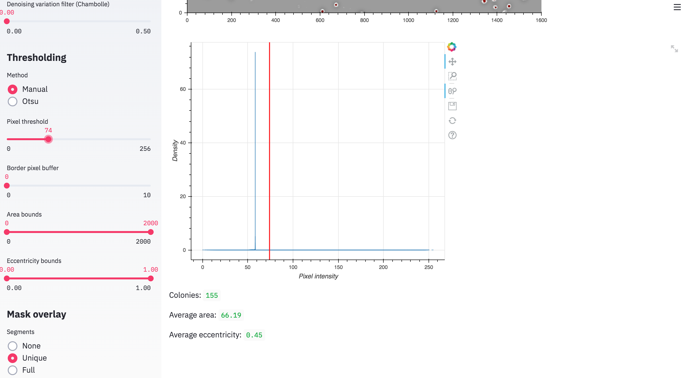

# Cell Counter

Count number of colonies on petri plates or cells from microscopy images. 

## Example

```
streamlit run main.py
```

#### 1. Upload image

Upload image in jpg, tif, or png format. The image is interactive and allows for zooming and panning. Further options include changing the colorscheme or scaling the size through the height input on the sidebar.



#### 2. Filter and thresholding

To optimize detection of colonies, adjust the filter and thresholding options to minimize background noise. The default Otsu method will generally segment well, and the bounding options can be tuned to select for a target size/shape of cells.   



#### 3. Manual thresholding

Manual thresholding can be performed by selecting the checkbox, this opens a slider to pick the pixel threshold. A histogram plotting the distribution of pixel intensities and statistics for the counts are displyed below. 


